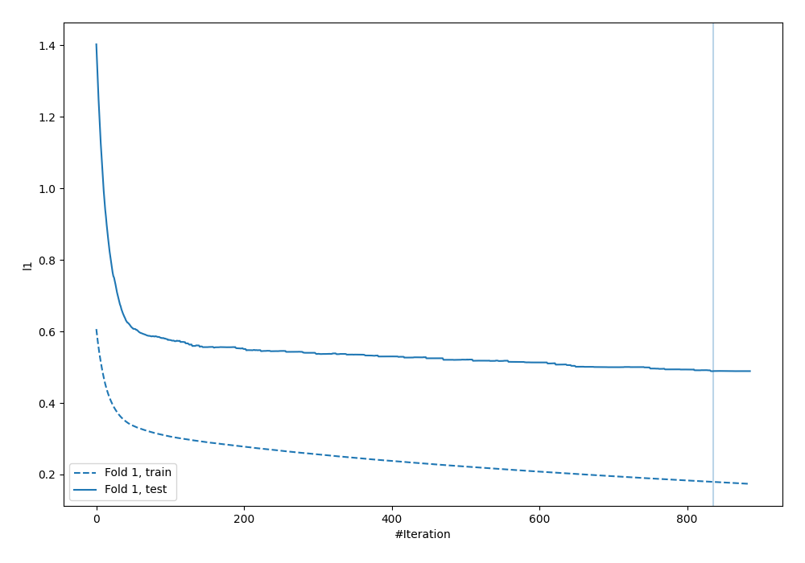
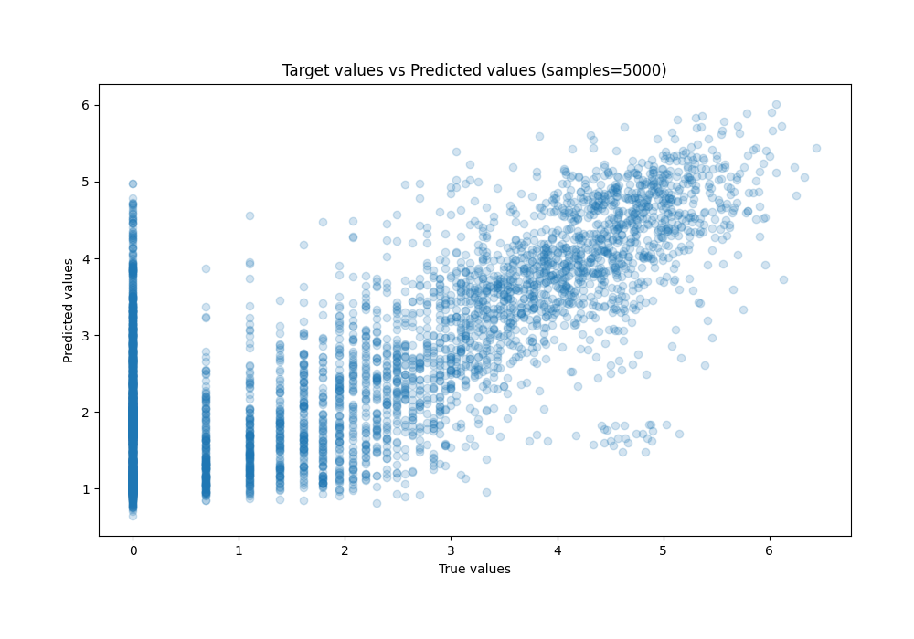
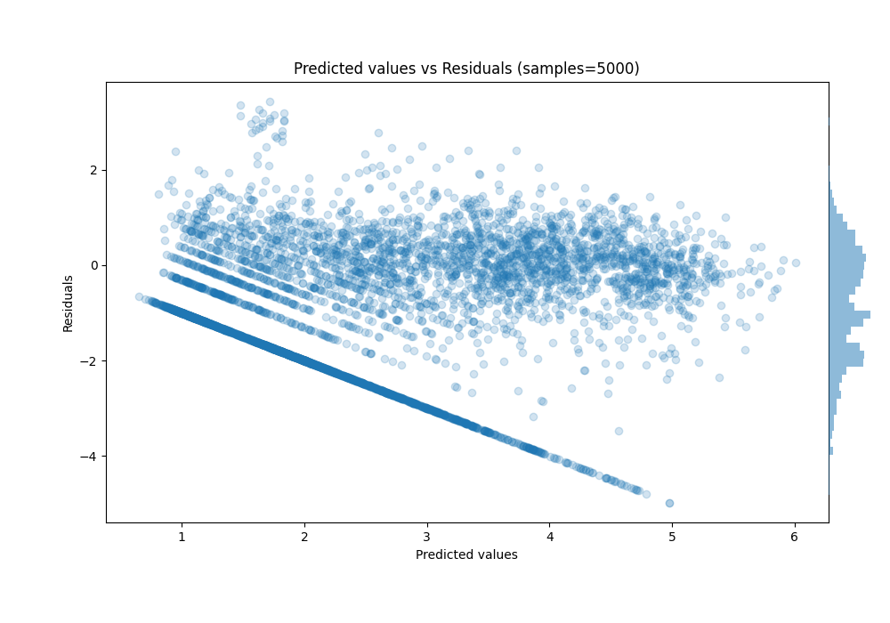

# Summary of 34_LightGBM

[<< Go back](../README.md)

## LightGBM
- **n_jobs**: -1
- **objective**: regression
- **num_leaves**: 63
- **learning_rate**: 0.05
- **feature_fraction**: 0.9
- **bagging_fraction**: 0.9
- **min_data_in_leaf**: 20
- **metric**: l1
- **custom_eval_metric_name**: None
- **explain_level**: 0

## Validation
 - **validation_type**: split
 - **train_ratio**: 0.9
 - **shuffle**: False

## Optimized metric
mae

## Training time

7.0 seconds

### Metric details:
| Metric   |    Score |
|:---------|---------:|
| MAE      | 0.617033 |
| MSE      | 0.741825 |
| RMSE     | 0.861293 |
| R2       | 0.495978 |
| MAPE     | 0.220379 |

## Learning curves

## True vs Predicted

## Predicted vs Residuals

[<< Go back](../README.md)
