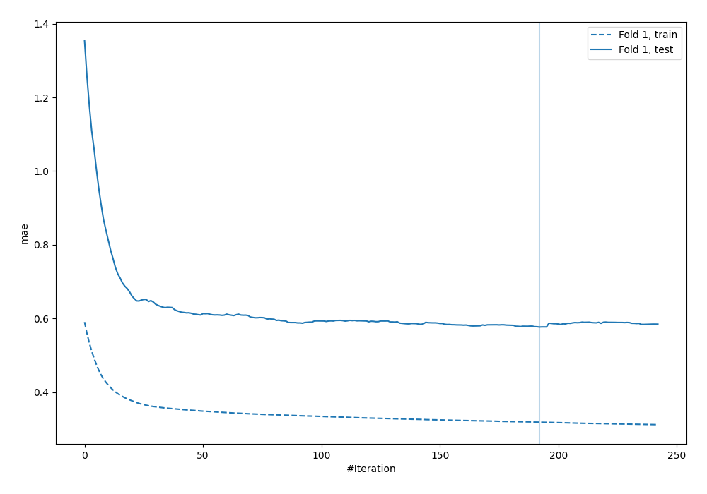
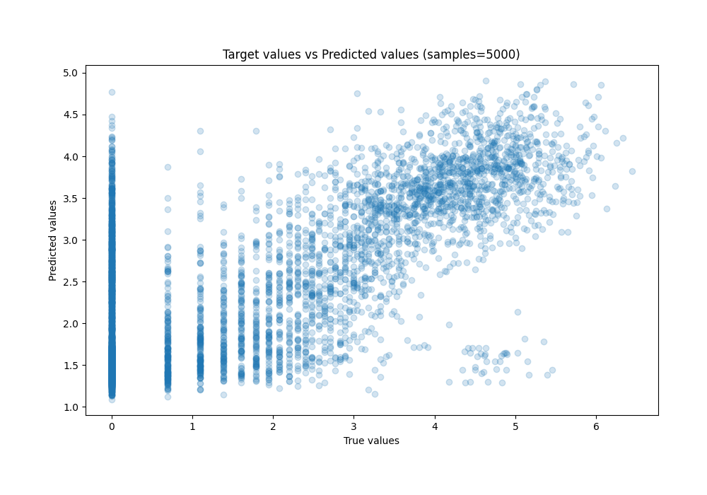
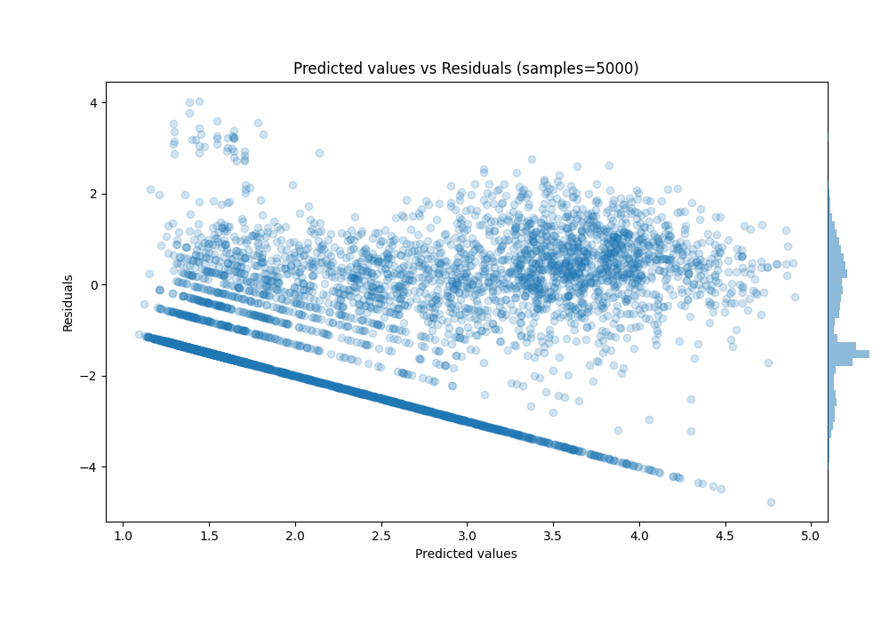

# Summary of 35_CatBoost

[<< Go back](../README.md)

## CatBoost
- **n_jobs**: -1
- **learning_rate**: 0.1
- **depth**: 6
- **rsm**: 0.8
- **loss_function**: RMSE
- **eval_metric**: MAE
- **explain_level**: 0

## Validation
 - **validation_type**: split
 - **train_ratio**: 0.9
 - **shuffle**: False

## Optimized metric
mae

## Training time

13.0 seconds

### Metric details:
| Metric   |    Score |
|:---------|---------:|
| MAE      | 0.728217 |
| MSE      | 0.957546 |
| RMSE     | 0.978543 |
| R2       | 0.349409 |
| MAPE     | 0.246278 |

## Learning curves

## True vs Predicted

## Predicted vs Residuals

[<< Go back](../README.md)
